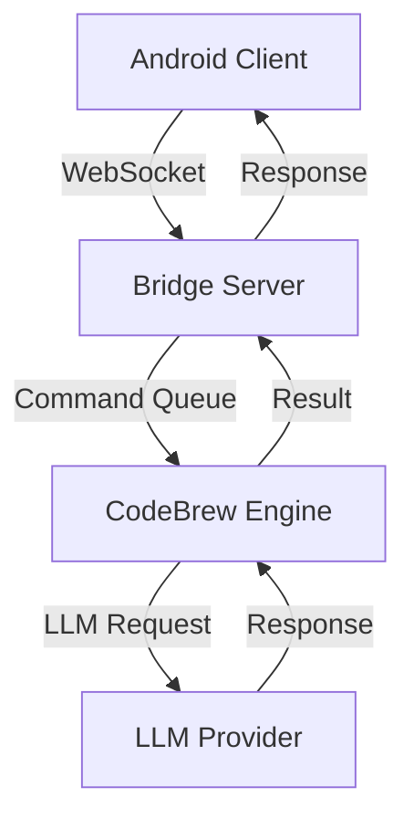

# JARVIS MK7 Developer Documentation

## Architecture Overview

### System Components

1. **CodeBrew Engine**
   - Core Python execution environment
   - LLM integration layer
   - Command processing pipeline
   - Memory and resource management
   - Caching system

2. **Android Bridge Server**
   - WebSocket server (Socket.IO)
   - REST API endpoints
   - Device management
   - Command routing
   - Response caching

3. **Android Client**
   - WebSocket client
   - Command executor
   - System integration
   - Background service

### Data Flow



## Development Environment Setup

### Required Tools
```bash
# Python environment
python -m pip install --upgrade pip
python -m pip install poetry
poetry install

# Node.js environment
npm install -g pnpm
pnpm install

# Development tools
npm install -g typescript ts-node nodemon
pip install black isort mypy pytest
```

### IDE Configuration

#### VSCode Settings
```json
{
  "python.linting.enabled": true,
  "python.linting.pylintEnabled": true,
  "python.formatting.provider": "black",
  "editor.formatOnSave": true,
  "editor.codeActionsOnSave": {
    "source.organizeImports": true
  }
}
```

#### PyCharm Configuration
- Enable pytest as default test runner
- Set black as code formatter
- Enable type checking mode

## Testing Strategy

### Unit Tests
- Located in `tests/` directory
- Follow AAA pattern (Arrange, Act, Assert)
- Use fixtures for common setup
- Mock external dependencies

Example:
```python
@pytest.mark.unit
async def test_command_execution():
    # Arrange
    config = CodeBrewConfig(timeout=5.0)
    command = "print('test')"
    
    # Act
    result = await execute_command(command, config)
    
    # Assert
    assert result.output == "test\n"
    assert result.return_code == 0
```

### Integration Tests
- Test component interactions
- Use real dependencies when possible
- Focus on error cases
- Test timeouts and retries

### Performance Tests
- Measure response times
- Check memory usage
- Test concurrent execution
- Verify resource cleanup

## Code Style Guide

### Python
```python
# Imports
from typing import Optional, List
import standard_library
import third_party
import local_package

# Constants
MAX_RETRIES = 3
DEFAULT_TIMEOUT = 30.0

# Classes
class MyClass:
    """Class docstring with type information."""
    
    def __init__(self, param: str) -> None:
        self.param = param
    
    def method(self) -> Optional[str]:
        """Method docstring with return type."""
        return self.param
```

### TypeScript
```typescript
// Interfaces
interface Config {
  timeout: number;
  retries: number;
}

// Type definitions
type CommandResult = {
  output: string;
  error?: string;
  code: number;
};

// Classes
class CommandExecutor {
  private config: Config;
  
  constructor(config: Config) {
    this.config = config;
  }
  
  async execute(command: string): Promise<CommandResult> {
    // Implementation
  }
}
```

## Performance Optimization

### Memory Management
- Use streaming for large responses
- Implement proper cleanup
- Monitor memory usage
- Use weak references

### Caching Strategy
```python
from cachetools import TTLCache, LRUCache

# Response cache
response_cache = TTLCache(
    maxsize=1000,
    ttl=3600
)

# Result cache
result_cache = LRUCache(
    maxsize=100
)
```

### Connection Pooling
```typescript
const pool = new ConnectionPool({
  max: 10,
  min: 2,
  idleTimeoutMillis: 30000
});
```

## Error Handling

### Error Types
```python
class CodeBrewError(Exception):
    """Base error for CodeBrew operations."""
    pass

class ExecutionError(CodeBrewError):
    """Error during code execution."""
    def __init__(self, message: str, code: int) -> None:
        self.code = code
        super().__init__(message)

class TimeoutError(CodeBrewError):
    """Execution timeout error."""
    pass
```

### Error Recovery
```python
async def execute_with_retry(func, *args, **kwargs):
    for attempt in range(MAX_RETRIES):
        try:
            return await func(*args, **kwargs)
        except Exception as e:
            if attempt == MAX_RETRIES - 1:
                raise
            await asyncio.sleep(2 ** attempt)
```

## Monitoring and Logging

### Metrics Collection
```python
from dataclasses import dataclass
from typing import Dict

@dataclass
class Metrics:
    requests_total: int = 0
    requests_failed: int = 0
    average_response_time: float = 0.0
    active_connections: int = 0
```

### Logging Configuration
```python
import logging
from logging.handlers import RotatingFileHandler

logger = logging.getLogger(__name__)
logger.setLevel(logging.INFO)

handler = RotatingFileHandler(
    'app.log',
    maxBytes=1024*1024,
    backupCount=5
)
handler.setFormatter(logging.Formatter(
    '%(asctime)s - %(name)s - %(levelname)s - %(message)s'
))
logger.addHandler(handler)
```

## Deployment

### Docker Configuration
```dockerfile
# Multi-stage build
FROM python:3.8-slim as builder
WORKDIR /app
COPY requirements.txt .
RUN pip install --user -r requirements.txt

FROM python:3.8-slim
WORKDIR /app
COPY --from=builder /root/.local /root/.local
COPY . .
ENV PATH=/root/.local/bin:$PATH
CMD ["python", "main.py"]
```

### Environment Variables
```bash
# Development
export NODE_ENV=development
export DEBUG=true
export LOG_LEVEL=debug

# Production
export NODE_ENV=production
export DEBUG=false
export LOG_LEVEL=info
```

## Security Considerations

### API Security
- Use API keys for authentication
- Implement rate limiting
- Validate all inputs
- Sanitize code execution
- Monitor for abuse

### WebSocket Security
- Implement heartbeat
- Validate messages
- Handle disconnections
- Prevent DoS attacks

### Resource Limits
```python
LIMITS = {
    'max_execution_time': 30,
    'max_memory_mb': 512,
    'max_output_size': 10000,
    'max_concurrent_requests': 10
}
```

## Troubleshooting Guide

### Common Issues
1. Connection timeouts
2. Memory leaks
3. Rate limiting
4. Authentication failures

### Debugging Tools
```bash
# Memory profiling
python -m memory_profiler main.py

# CPU profiling
python -m cProfile -o output.prof main.py

# Log analysis
tail -f logs/app.log | grep ERROR

# Network debugging
tcpdump -i lo0 port 3000
```

## Performance Benchmarks

### Test Scenarios
1. Single command execution
2. Concurrent requests
3. Large response handling
4. Memory usage patterns

### Benchmark Results
```python
BENCHMARKS = {
    'single_command': {
        'avg_time': 0.5,  # seconds
        'p95_time': 1.2,  # seconds
        'max_memory': 100  # MB
    },
    'concurrent_50': {
        'avg_time': 2.0,  # seconds
        'p95_time': 3.5,  # seconds
        'max_memory': 500  # MB
    }
}
``` 